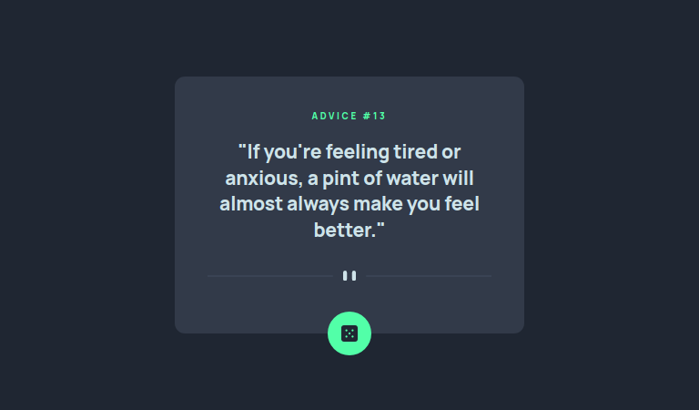
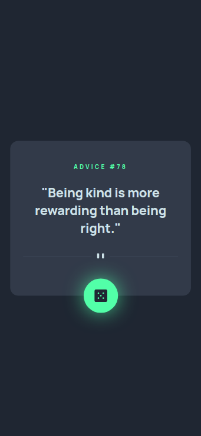

# Frontend Mentor - Advice generator app solution

This is a solution to the [Advice generator app challenge on Frontend Mentor](https://www.frontendmentor.io/challenges/advice-generator-app-QdUG-13db). Frontend Mentor challenges help you improve your coding skills by building realistic projects.

## Table of contents

- [Frontend Mentor - Advice generator app solution](#frontend-mentor---advice-generator-app-solution)
  - [Table of contents](#table-of-contents)
  - [Overview](#overview)
    - [The challenge](#the-challenge)
    - [Screenshot](#screenshot)
      - [Desktop](#desktop)
      - [Mobile](#mobile)
    - [Links](#links)
  - [My process](#my-process)
    - [Built with](#built-with)
    - [Useful resources](#useful-resources)
  - [Author](#author)

**Note: Delete this note and update the table of contents based on what sections you keep.**

## Overview

### The challenge

Users should be able to:

- View the optimal layout for the app depending on their device's screen size
- See hover states for all interactive elements on the page
- Generate a new piece of advice by clicking on the dice icon

### Screenshot

#### Desktop

#### Mobile

### Links

- Solution URL: [View it on GitHub](https://github.com/hooiyan/fem-advice-generator-app)
- Live Site URL: [View it on Vercel](https://h2y-advice-generator.vercel.app/)

## My process

### Built with

- Semantic HTML5 markup
- CSS custom properties
- Flexbox
- Desktop-first workflow
- [Advice Slip API](https://api.adviceslip.com/)

### Useful resources

- [MDN Fetch API documentation](https://developer.mozilla.org/en-US/docs/Web/API/Fetch_API/Using_Fetch) - This helped me relearn the syntax for using `Fetch API`.
- [MDN box-shadow documentation](https://developer.mozilla.org/en-US/docs/Web/CSS/box-shadow) - I always forget what does each value represent in the `box-shadow` property. 
- [Center a `position: absolute` element](https://stackoverflow.com/questions/8508275/how-to-center-a-position-absolute-element) - This helped me ini centering the randomize button at the center.

## Author

<!-- - Website - [Add your name here](https://www.your-site.com) -->
- Frontend Mentor - [@hooiyan](https://www.frontendmentor.io/profile/hooiyan)
